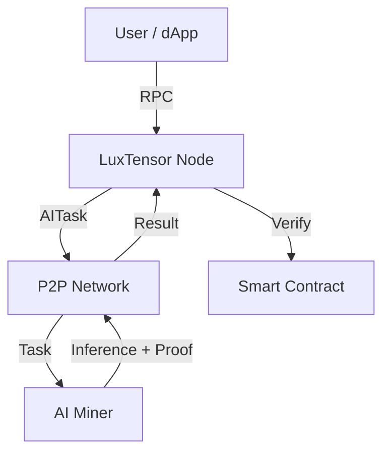

# Architecture

ModernTensor (LuxTensor implementation) is built as a high-performance Rust workspace.

## System Overview

## Core Crates

The codebase is organized into specialized crates:

| Crate | Logic | Description |
|-------|-------|-------------|
| **luxtensor-core** | Blockchain | Block, Transaction, Account, State |
| **luxtensor-contracts** | EVM | Native AI Precompiles implementation |
| **luxtensor-consensus** | Consensus | Proof of Stake engine |
| **luxtensor-network** | Networking | libp2p based communication |
| **luxtensor-storage** | DB | RocksDB storage layer |
| **luxtensor-oracle** | AI | Off-chain Oracle & ZK prover |

## The AI Layer

The unique innovation is the **AI Layer**:

1. **Instruction**: User calls `0x10` (AI_REQUEST).
2. **Dispatch**: Node detects opcode, dispatches task via P2P.
3. **Execution**: Miners run inference off-chain.
4. **Verification**: Miners generate ZK proof.
5. **Settlement**: Proof verified on-chain (`0x11`), payment released.
