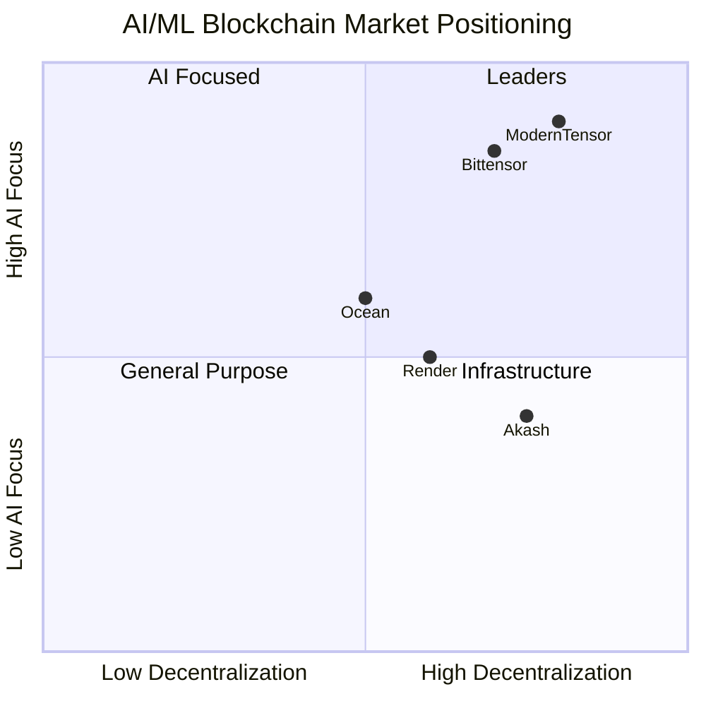
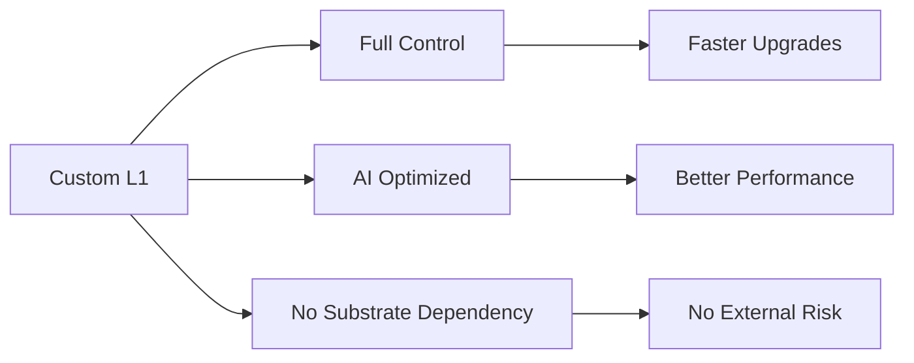
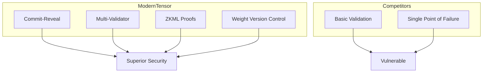
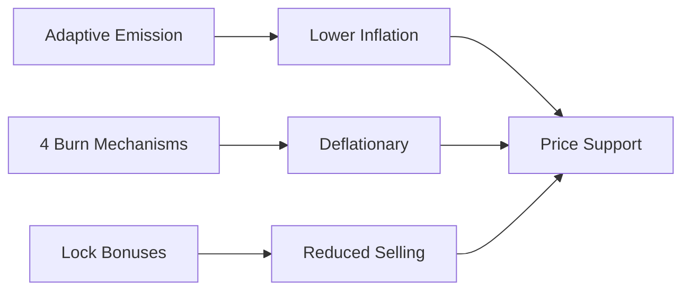

# ModernTensor Competitive Analysis

**Market Positioning vs Key Competitors**

---

## Market Landscape

---

## Direct Competitor: Bittensor (TAO)

### Head-to-Head Comparison

| Feature | ModernTensor | Bittensor | Winner |
|---------|--------------|-----------|--------|
| **Blockchain** | Custom L1 (Rust) | Substrate | 🏆 MT |
| **Daily Emission** | 0-2,876 adaptive | 7,200 fixed | 🏆 MT |
| **Burn Mechanisms** | 4 types | None | 🏆 MT |
| **Entry Barrier** | 0 MDT | 1000+ TAO | 🏆 MT |
| **Anti-Cheat** | Commit-reveal + ZKML | Basic | 🏆 MT |
| **TPS** | 1,000+ | ~100 | 🏆 MT |
| **DAO Treasury** | 13% | 0% | 🏆 MT |
| **Market Cap** | Pre-launch | $4B+ | TAO |
| **Ecosystem** | Growing | Established | TAO |

### Key Advantages Over Bittensor

1. **72-99% Less Inflation** - Adaptive vs fixed emission
2. **Deflationary Model** - 4 burn mechanisms create scarcity
3. **Lower Entry Barrier** - 0 MDT to start (vs 1000+ TAO)
4. **Superior Anti-Cheat** - Commit-reveal + multi-validator

---

## Other Competitors

### Render Network (RNDR)

| Aspect | ModernTensor | Render |
|--------|--------------|--------|
| **Focus** | AI/ML Training | GPU Rendering |
| **Blockchain** | Own L1 | Ethereum L2 |
| **Token Model** | Adaptive | Fixed inflation |

**Differentiation**: ModernTensor focuses on AI training, not rendering.

---

### Akash Network (AKT)

| Aspect | ModernTensor | Akash |
|--------|--------------|-------|
| **Focus** | AI-specific | General compute |
| **Consensus** | PoS + AI Validation | PoS |
| **Anti-Cheat** | Built-in | None |

**Differentiation**: ModernTensor has AI-specific consensus and anti-cheat.

---

### Ocean Protocol (OCEAN)

| Aspect | ModernTensor | Ocean |
|--------|--------------|-------|
| **Focus** | AI Compute | Data Marketplace |
| **Model** | Compute network | Data exchange |
| **Token Utility** | Rewards + Governance | Data access |

**Differentiation**: ModernTensor provides compute, Ocean provides data.

---

## Competitive Moats

### 1. Custom L1 Blockchain

### 2. Anti-Cheat Mechanisms

### 3. Sustainable Tokenomics

---

## Market Opportunity

| Market | 2024 | 2030 | CAGR |
|--------|------|------|------|
| **AI Infrastructure** | $30B | $200B | 35% |
| **Decentralized AI** | $2B | $50B | 70% |
| **Crypto AI Tokens** | $10B | $100B | 50% |

**ModernTensor Target**: Capture 5-10% of decentralized AI market.

---

## Summary: Why ModernTensor Wins

| Advantage | Impact |
|-----------|--------|
| **Custom L1** | Full control, no dependency |
| **Adaptive Emission** | 72-99% less inflation |
| **4 Burns** | Long-term deflationary |
| **Anti-Cheat** | Protects network integrity |
| **0 MDT Entry** | Accessible to all |
| **DAO Treasury** | Sustainable development |

---

*Last Updated: January 2026*
