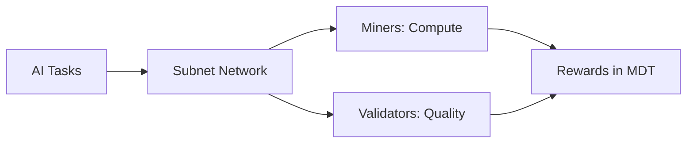
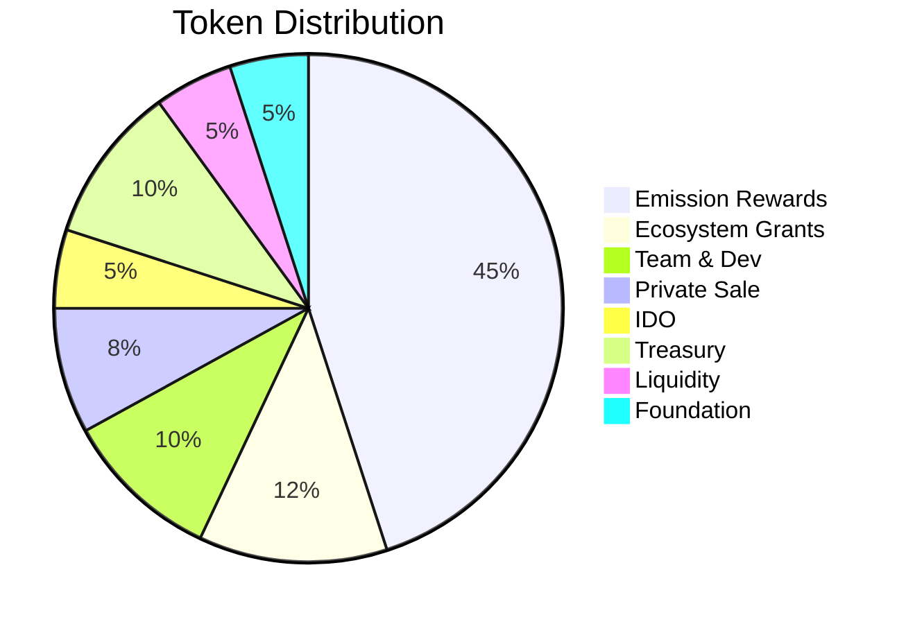
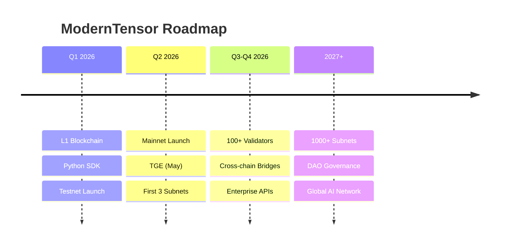

# ModernTensor - Investor Technical Summary

**One-Pager for Technical Due Diligence**

---

## What is ModernTensor?

**Decentralized AI infrastructure** - A custom Layer 1 blockchain (Luxtensor) powering distributed machine learning with crypto-economic incentives.



---

## Key Technical Differentiators

| Feature | ModernTensor | Bittensor | Advantage |
|---------|--------------|-----------|-----------|
| **Blockchain** | Custom L1 (Rust) | Substrate | Full control |
| **Emission** | Adaptive (0-100%) | Fixed 7,200/day | 72-99% less inflation |
| **Burns** | 4 mechanisms | None | Deflationary |
| **Entry Barrier** | 0 MDT | 1000+ TAO | Accessible |
| **Anti-Cheat** | Commit-reveal + ZKML | Basic | Superior |

---

## Technology Stack

```
┌─────────────────────────────────────────┐
│ Luxtensor L1 Blockchain (Rust)          │
├─────────────────────────────────────────┤
│ • 6-sec blocks | 1000 TPS | EVM compat  │
│ • PoS + AI Validation consensus         │
│ • RocksDB storage | libp2p networking   │
└─────────────────────────────────────────┘
           │
┌─────────────────────────────────────────┐
│ Python SDK (2000+ methods)              │
├─────────────────────────────────────────┤
│ • LuxtensorClient | Axon | Dendrite     │
│ • Commit-reveal | ZKML Scoring          │
│ • CLI tools | Monitoring                │
└─────────────────────────────────────────┘
```

---

## Development Completion

| Component | Status | Lines of Code |
|-----------|--------|---------------|
| Blockchain Core | ✅ 100% | ~15,000 |
| Consensus Engine | ✅ 100% | ~5,000 |
| RPC Server | ✅ 100% | ~10,000 |
| Python SDK | ✅ 95% | ~20,000 |
| Anti-Cheat | ✅ 90% | ~3,000 |
| Testnet | ✅ Running | - |

**Total: 50,000+ lines of production code**

---

## Token Economics (MDT)



| Metric | Value |
|--------|-------|
| **Max Supply** | 21,000,000 MDT |
| **Private Sale** | 8% (1.68M MDT) |
| **Team Vesting** | 1yr cliff + 4yr linear |
| **Investor Vesting** | 1yr cliff + 2yr linear |

---

## Roadmap Milestones



---

## Security Model

- **Cryptographic**: ECDSA, Keccak256
- **Economic**: Stake slashing (up to 100%)
- **Consensus**: Multi-validator, commit-reveal
- **Anti-Cheat**: Weight version control, anomaly detection

---

## Investment Highlights

✅ **Working Product** - Testnet running, 50K+ lines of code
✅ **Superior Economics** - 72-99% less inflation than competitors
✅ **Defensible Tech** - Custom L1 with anti-cheat mechanisms
✅ **Clear Roadmap** - Mainnet Q2 2026, TGE May 2026
✅ **Strong Tokenomics** - 4 burn mechanisms, progressive staking

---

## Links

| Resource | URL |
|----------|-----|
| **Technical Docs** | [TECHNICAL_OVERVIEW.md](./TECHNICAL_OVERVIEW.md) |
| **Architecture** | [ARCHITECTURE_DIAGRAMS.md](./architecture/ARCHITECTURE_DIAGRAMS.md) |
| **Tokenomics** | [TOKENOMICS.md](./TOKENOMICS.md) |
| **Whitepaper** | [WhitePaper.pdf](./WhitePaper.pdf) |

---

*ModernTensor Foundation | <invest@moderntensor.io>*
