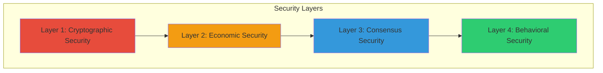
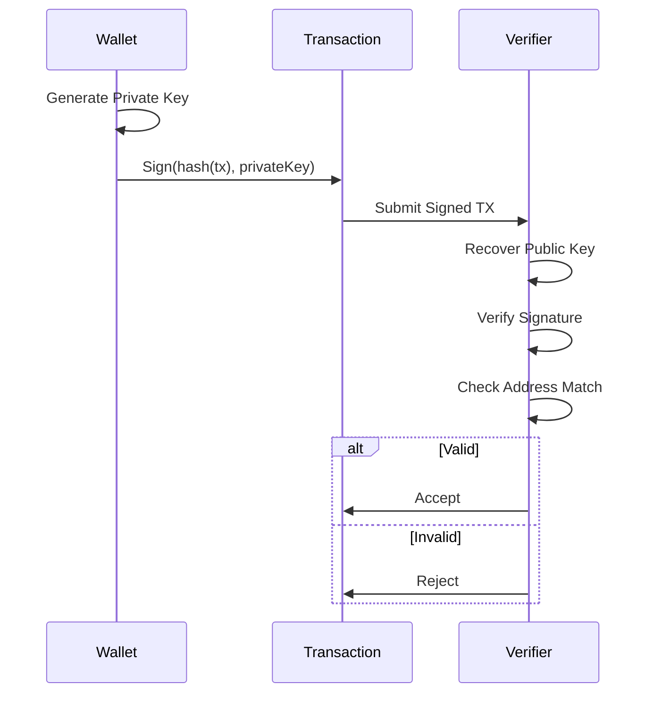
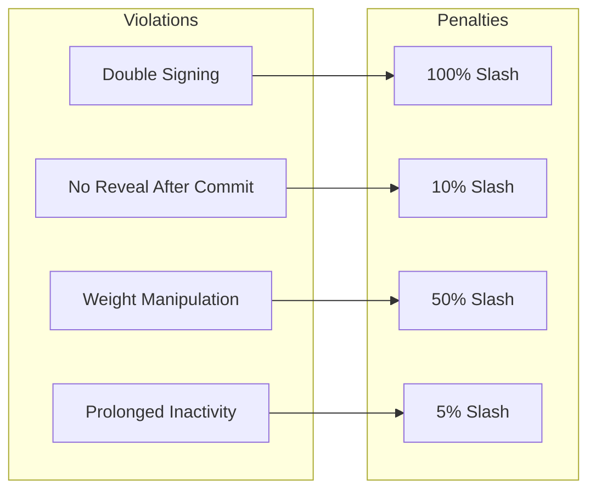
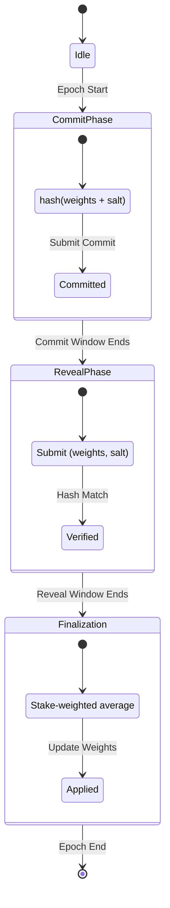
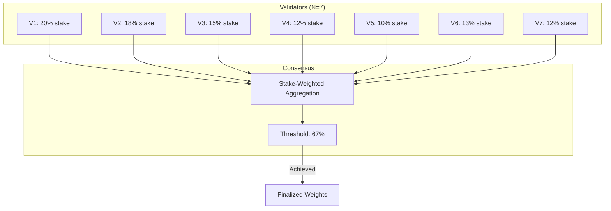
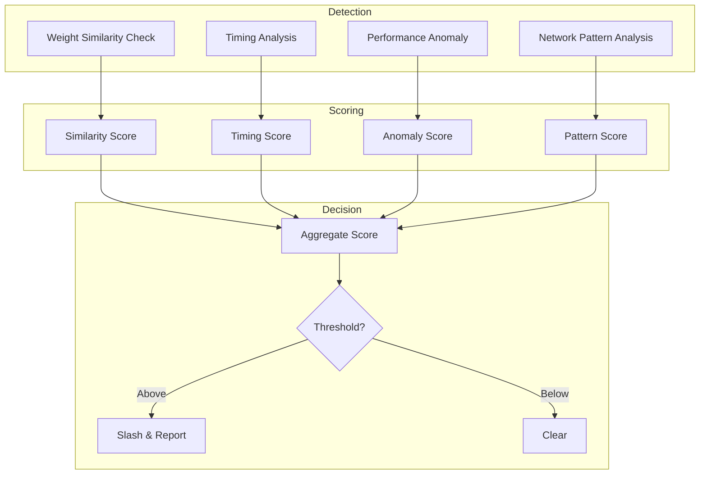
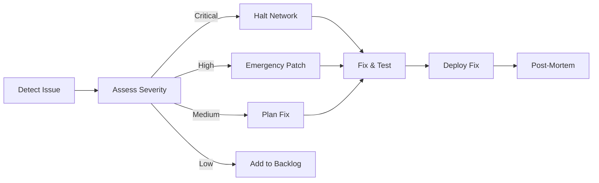

# ModernTensor Security Architecture

**Comprehensive security model and anti-cheat mechanisms**

---

## Security Overview

ModernTensor implements a **4-layer security model** to protect against various attack vectors in decentralized AI networks.



---

## Layer 1: Cryptographic Security

### Key Technologies

| Component | Algorithm | Purpose |
|-----------|-----------|---------|
| **Signatures** | ECDSA secp256k1 | Transaction authentication |
| **Hashing** | Keccak256 | Block hashing, commit hashes |
| **Key Derivation** | BIP39/BIP32 | HD wallet generation |
| **Address Format** | Ethereum-compatible | 20-byte addresses |

### Transaction Security Flow



---

## Layer 2: Economic Security

### Stake-Based Protection

| Mechanism | Description | Penalty |
|-----------|-------------|---------|
| **Minimum Stake** | Required to participate | None (barrier to entry) |
| **Slashing** | Penalty for misbehavior | Up to 100% stake |
| **Jailing** | Temporary suspension | Lost rewards |
| **Bonding Period** | Lock-up for unstaking | 7-day delay |

### Slashing Conditions



### Economic Attack Resistance

| Attack | Cost Model | Mitigation |
|--------|------------|------------|
| **51% Attack** | Acquire 51% stake (~$X million) | Stake distribution monitoring |
| **Sybil Attack** | N × minimum_stake | High stake requirements |
| **Bribery** | Must outbid honest rewards | Slashing > potential gain |

---

## Layer 3: Consensus Security

### Commit-Reveal Scheme

Prevents weight manipulation by hiding weights until all validators commit.



### Multi-Validator Consensus



---

## Layer 4: Behavioral Security (Anti-Cheat)

### Threat Model

| Threat | Description | Detection |
|--------|-------------|-----------|
| **Weight Copying** | Validator copies other's weights | Commit-reveal timing |
| **Free-Riding** | Miner doesn't compute, copies results | Cross-validator verification |
| **Validator Collusion** | Validators agree to cheat | Stake distribution monitoring |
| **Result Manipulation** | Miner sends fake results | Multi-validator scoring |

### Anti-Cheat Detection Flow



### Weight Copying Prevention

```python
# Commit Phase
commit_hash = keccak256(encode(weights) + salt)
submit_commit(subnet_id, commit_hash)

# Reveal Phase (after commit window)
submit_reveal(subnet_id, weights, salt)

# Verification
assert keccak256(encode(weights) + salt) == stored_commit_hash
```

---

## Security Audit Status

| Component | Audit Status | Findings |
|-----------|--------------|----------|
| **Core Cryptography** | ✅ Internal Review | 0 Critical |
| **Consensus Logic** | ✅ Internal Review | 0 Critical |
| **Smart Contracts** | 🔄 Pending External | - |
| **RPC Security** | ✅ Internal Review | 2 Medium (fixed) |
| **P2P Network** | ✅ Internal Review | 1 Low |

---

## Incident Response

### Security Incident Levels

| Level | Definition | Response Time |
|-------|------------|---------------|
| **Critical** | Funds at risk | <1 hour |
| **High** | Consensus disruption | <4 hours |
| **Medium** | Service degradation | <24 hours |
| **Low** | Minor issues | <7 days |

### Response Flow



---

## Best Practices for Participants

### For Validators

- Use hardware security keys for signing
- Run nodes in isolated environments
- Monitor for unusual network activity
- Never share private keys or seeds

### For Miners

- Verify validator authenticity
- Use encrypted connections
- Regular security updates
- Backup keys securely

### For Developers

- Follow secure coding guidelines
- Audit all smart contracts
- Use rate limiting on APIs
- Implement input validation

---

*Last Updated: January 2026*
