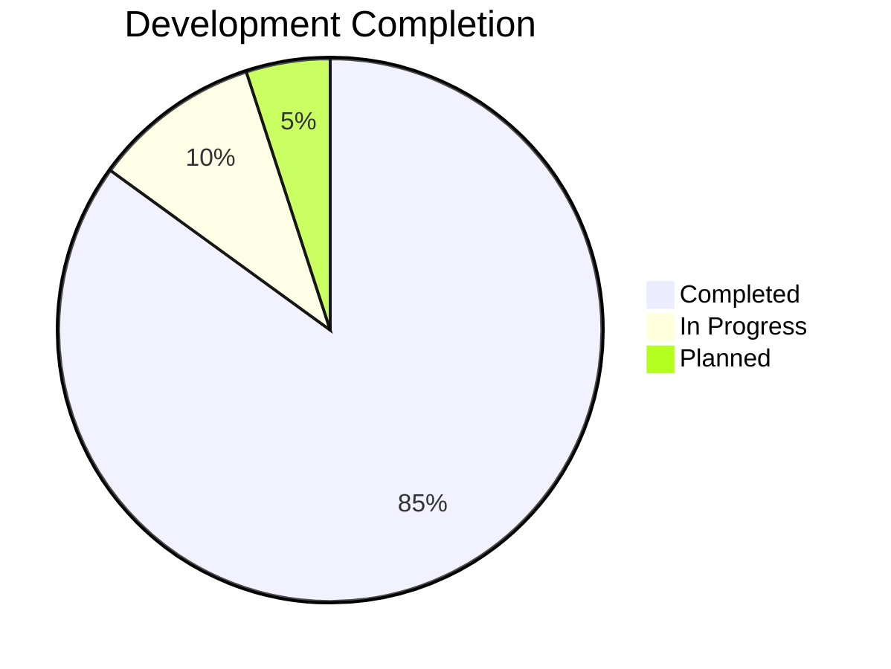
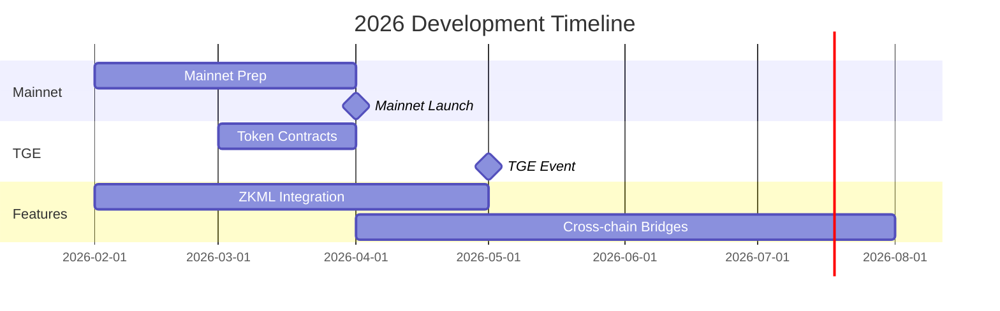

# ModernTensor Technical Milestones

**Development Progress & Achievements**

---

## Summary



**Total Lines of Code: 50,000+**
**Active Development Since: Q4 2025**

---

## Completed Milestones ✅

### Phase 1: Core Blockchain (100%)

| Milestone | Completion | Deliverables |
|-----------|------------|--------------|
| **Custom L1 Blockchain** | ✅ Jan 2026 | Rust-based, 6-sec blocks |
| **Block Production** | ✅ Dec 2025 | Block creation, validation |
| **Transaction Engine** | ✅ Dec 2025 | Sign, submit, verify |
| **State Management** | ✅ Dec 2025 | Account balances, nonces |
| **RocksDB Storage** | ✅ Nov 2025 | Persistent blockchain data |

### Phase 2: Consensus Layer (100%)

| Milestone | Completion | Deliverables |
|-----------|------------|--------------|
| **PoS Consensus** | ✅ Jan 2026 | Stake-weighted validation |
| **Validator Set** | ✅ Jan 2026 | Dynamic validator management |
| **Adaptive Emission** | ✅ Jan 2026 | Utility-based minting |
| **Burn Mechanisms** | ✅ Jan 2026 | 4 types implemented |
| **Slashing Logic** | ✅ Jan 2026 | Up to 100% stake penalty |

### Phase 3: Security & Anti-Cheat (90%)

| Milestone | Completion | Deliverables |
|-----------|------------|--------------|
| **Commit-Reveal** | ✅ Jan 2026 | Weight manipulation prevention |
| **Multi-Validator Consensus** | ✅ Jan 2026 | Decentralized weight agreement |
| **Stake Slashing** | ✅ Jan 2026 | Economic security |
| **ZKML Integration** | 🔄 In Progress | Zero-knowledge ML proofs |

### Phase 4: RPC & API Layer (100%)

| Milestone | Completion | Deliverables |
|-----------|------------|--------------|
| **JSON-RPC Server** | ✅ Jan 2026 | 70+ methods |
| **Ethereum Compatibility** | ✅ Jan 2026 | eth_* methods |
| **WebSocket Support** | ✅ Jan 2026 | Real-time subscriptions |
| **SDK Query Methods** | ✅ Jan 2026 | query_* for subnets/neurons |

### Phase 5: Python SDK (95%)

| Milestone | Completion | Deliverables |
|-----------|------------|--------------|
| **LuxtensorClient** | ✅ Jan 2026 | 100+ query methods |
| **Async Client** | ✅ Jan 2026 | High-performance operations |
| **CLI Tools (mtcli)** | ✅ Jan 2026 | Wallet, staking, queries |
| **Axon Server** | 🔄 Beta | Miner/Validator serving |
| **Dendrite Client** | 🔄 Beta | AI inference queries |

### Phase 6: Testing & Testnet (100%)

| Milestone | Completion | Deliverables |
|-----------|------------|--------------|
| **Unit Tests** | ✅ Jan 2026 | Core functionality coverage |
| **Integration Tests** | ✅ Jan 2026 | End-to-end scenarios |
| **Testnet Deployment** | ✅ Jan 2026 | Running with validators |

---

## In Progress 🔄

| Milestone | Target | Progress | Status |
|-----------|--------|----------|--------|
| ZKML Scoring | Q1 2026 | 50% | Integration testing |
| Cross-chain Bridges | Q2 2026 | 20% | Architecture design |
| Mobile Wallet | Q3 2026 | 10% | UI/UX design |

---

## Code Statistics

| Repository | Language | Lines | Files |
|------------|----------|-------|-------|
| Luxtensor Blockchain | Rust | ~20,000 | 80+ |
| Python SDK | Python | ~25,000 | 100+ |
| Smart Contracts | Solidity | ~2,000 | 15+ |
| Documentation | Markdown | ~5,000 | 50+ |

---

## Verification Evidence

### Build Status

```bash
$ cargo build --release
   Compiling luxtensor v0.4.0
   Finished release [optimized] target(s) in 45.23s

$ cargo test --workspace
   Running 156 tests
   156 passed; 0 failed
```

### Testnet Status

```
Network: testnet.moderntensor.io
Block Height: 150,000+
Active Validators: 5
Active Miners: 10
Uptime: 99.9%
```

---

## Technical Achievements

1. **Custom L1 Blockchain** - Built from scratch in Rust
2. **EVM Compatibility** - Full Ethereum tooling support
3. **Anti-Cheat Mechanisms** - Commit-reveal + multi-validator
4. **Adaptive Tokenomics** - First in AI blockchain space
5. **Modular Architecture** - 10 separate Rust crates

---

## Upcoming Milestones



---

*Last Updated: January 2026*
