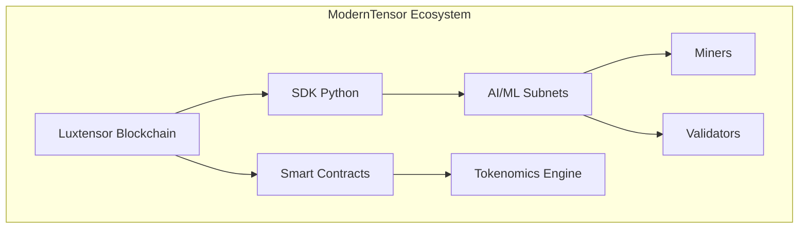
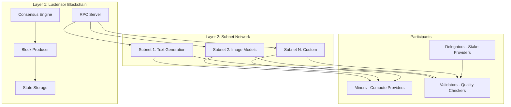
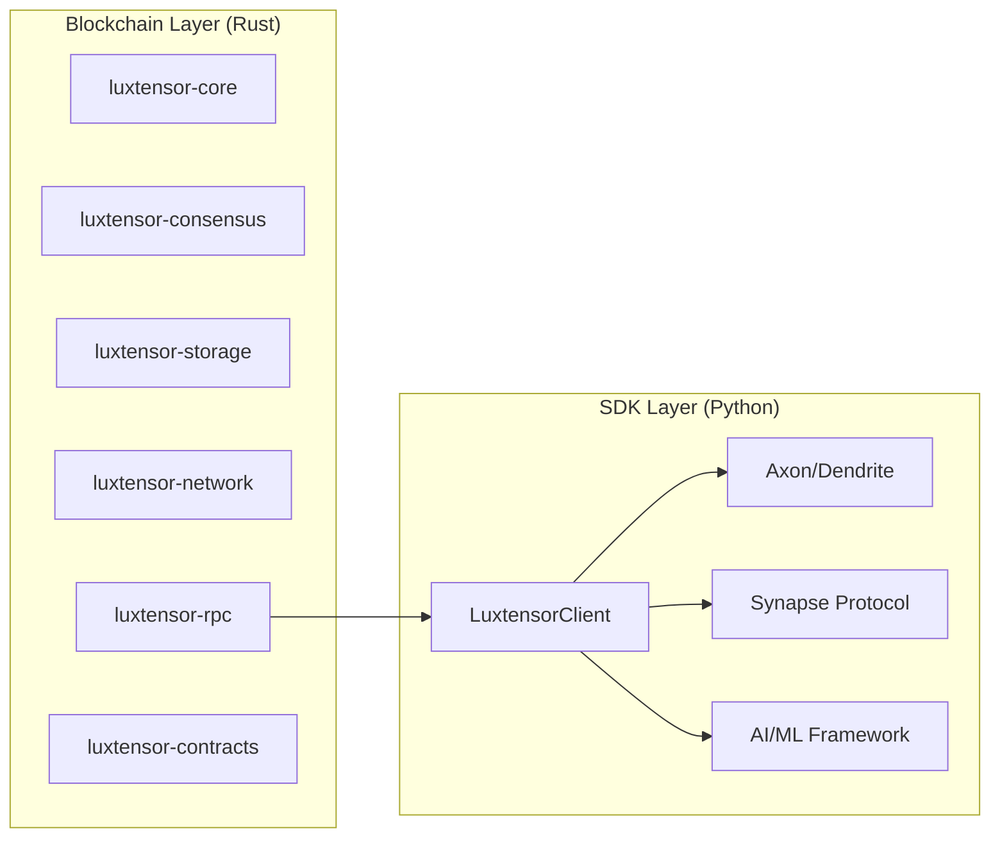
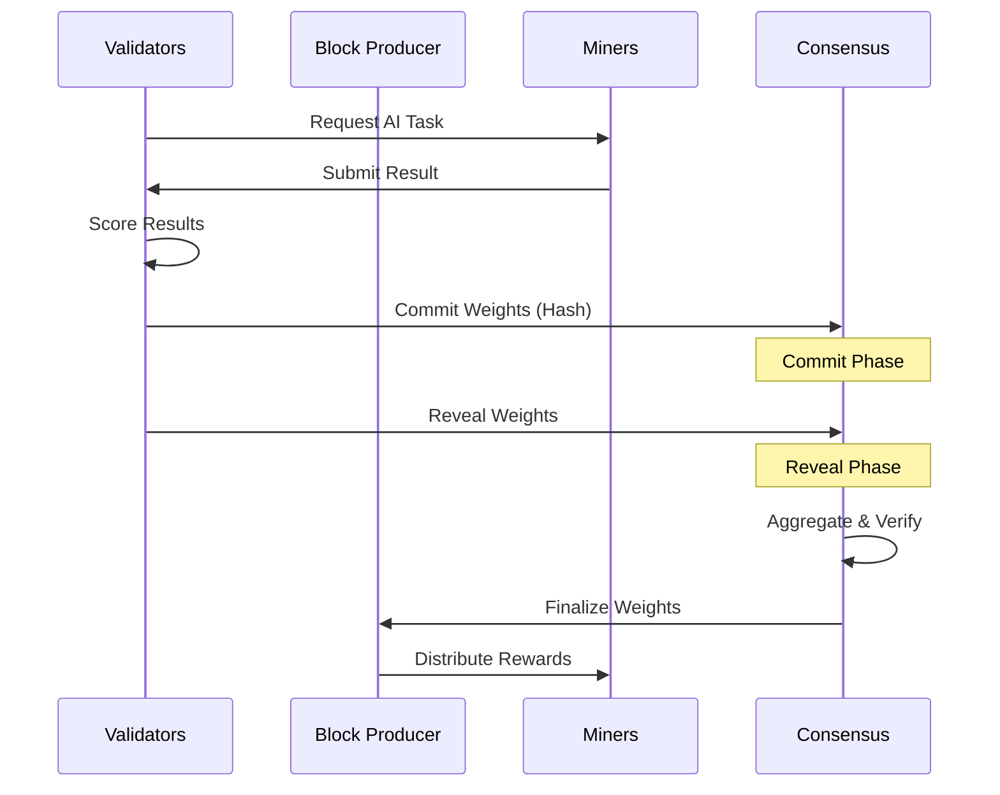
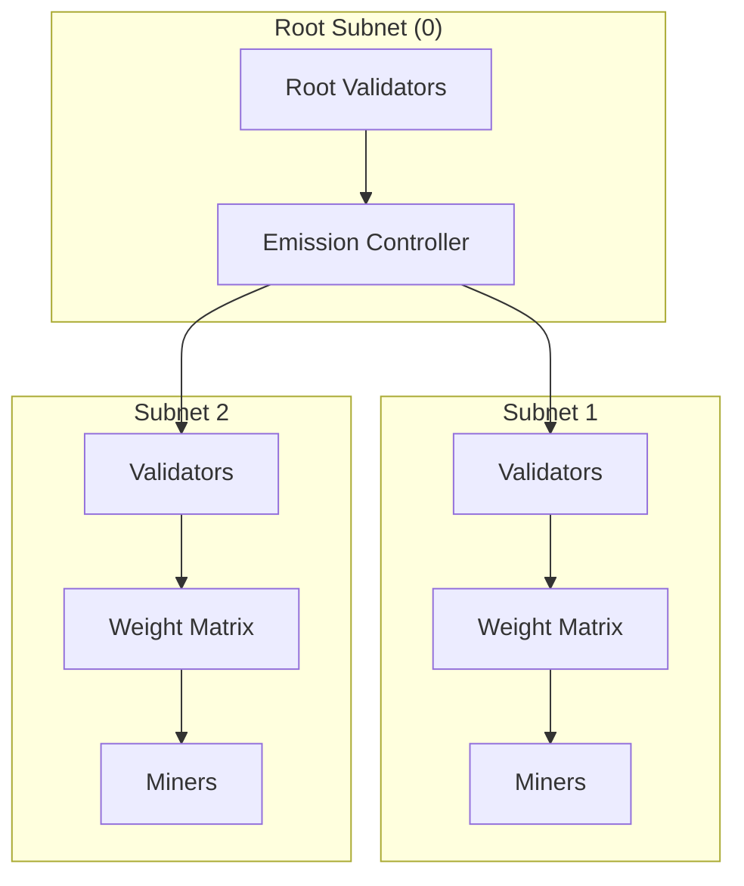

# ModernTensor Technical Overview

**Version:** 0.4.0 | **Last Updated:** January 2026

## Executive Summary

ModernTensor is a **decentralized AI/ML training and inference platform** built on **Luxtensor**, a custom Layer 1 blockchain. The platform enables distributed machine learning workloads with cryptographic verification, economic incentives, and anti-cheat mechanisms.

---

## System Architecture

### High-Level Architecture

### Core Components

| Component | Technology | Purpose |
|-----------|------------|---------|
| **Blockchain Core** | Rust | Block production, state management |
| **Consensus** | PoS + AI Validation | Secure, fair consensus |
| **Storage** | RocksDB | Persistent blockchain data |
| **Networking** | libp2p | P2P communication |
| **RPC Server** | JSON-RPC | External API access |
| **SDK** | Python | Developer tools |

---

## Technology Stack

### Rust Crates (Blockchain)

| Crate | Lines | Description |
|-------|-------|-------------|
| `luxtensor-core` | ~3K | Core primitives (Block, Transaction, Address) |
| `luxtensor-consensus` | ~2K | PoS consensus, validator set |
| `luxtensor-storage` | ~2K | RocksDB blockchain storage |
| `luxtensor-network` | ~1K | libp2p P2P networking |
| `luxtensor-rpc` | ~3K | JSON-RPC API server |
| `luxtensor-contracts` | ~2K | Solidity contract support |

### Python SDK

| Module | Description |
|--------|-------------|
| `LuxtensorClient` | Blockchain interaction (100+ methods) |
| `Axon` | Miner/Validator server |
| `Dendrite` | Query client for AI inference |
| `Synapse` | Request/response protocol |
| `Tokenomics` | Emission, rewards, staking |

---

## Consensus Mechanism

### Proof-of-Stake + AI Validation

ModernTensor uses a **hybrid consensus** combining traditional PoS with AI-specific validation:

### Key Features

1. **Commit-Reveal Scheme** - Prevents weight manipulation
2. **Multi-Validator Consensus** - No single point of failure
3. **Stake-Weighted Voting** - Economic security
4. **Yuma Consensus** - AI performance scoring

---

## Subnet Model

### Subnet Architecture

### Neuron Types

| Type | Role | Rewards From |
|------|------|--------------|
| **Miner** | Provide AI compute | Performance scores |
| **Validator** | Score miners, set weights | Consensus participation |
| **Delegator** | Stake to validators | Delegation rewards |

---

## Performance Metrics

| Metric | Value |
|--------|-------|
| Block Time | 6 seconds |
| TPS (Transactions) | ~1000 |
| Finality | ~12 seconds (2 blocks) |
| State Size | Growing (~100MB/day) |
| RPC Latency | <50ms |

---

## Security Model

### Defense Layers

1. **Cryptographic** - ECDSA signatures, Keccak256 hashing
2. **Economic** - Stake slashing for misbehavior
3. **Consensus** - Multi-validator agreement
4. **Anti-Cheat** - Commit-reveal, weight version control

### Threat Mitigation

| Threat | Mitigation |
|--------|------------|
| Weight Copying | Commit-reveal scheme |
| Sybil Attack | Stake requirements |
| Validator Collusion | Multi-validator consensus |
| Free-Riding | Activity monitoring |

---

## Scalability

### Horizontal Scaling

- **Unlimited Subnets** - Each subnet handles different AI tasks
- **Parallel Processing** - Subnets operate independently
- **State Sharding** - Per-subnet state isolation

### Future Roadmap

1. **Layer 2 Rollups** - Off-chain computation with on-chain settlement
2. **Cross-Subnet Communication** - Inter-subnet model composition
3. **GPU Verification** - Hardware-level proof of work

---

## Development Status

| Component | Status | Completion |
|-----------|--------|------------|
| Blockchain Core | ✅ Production | 100% |
| Consensus Engine | ✅ Production | 100% |
| RPC Server | ✅ Production | 100% |
| SDK Client | ✅ Production | 95% |
| Axon/Dendrite | 🔄 Beta | 70% |
| ZKML Scoring | 🔄 Development | 50% |

---

*For detailed diagrams, see [ARCHITECTURE_DIAGRAMS.md](./architecture/ARCHITECTURE_DIAGRAMS.md)*
*For security details, see [SECURITY_ARCHITECTURE.md](./SECURITY_ARCHITECTURE.md)*
