# ModernTensor Architecture Diagrams

**Complete visual reference for ModernTensor system architecture**

---

## 1. System Architecture Overview

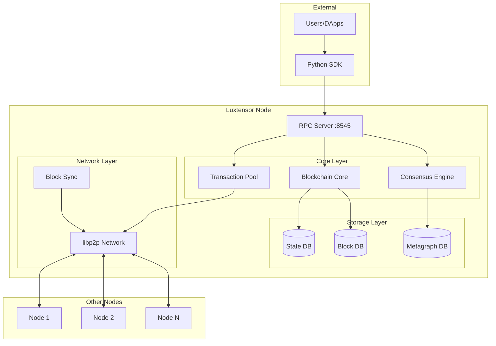
```mermaid
graph TB
    subgraph "External"
        U[Users/DApps]
        SDK[Python SDK]
    end

    subgraph "Luxtensor Node"
        RPC[RPC Server :8545]

        subgraph "Core Layer"
            BC[Blockchain Core]
            CS[Consensus Engine]
            TX[Transaction Pool]
        end

        subgraph "Storage Layer"
            SDB[(State DB)]
            BDB[(Block DB)]
            MDB[(Metagraph DB)]
        end

        subgraph "Network Layer"
            P2P[libp2p Network]
            SYNC[Block Sync]
        end
    end

    subgraph "Other Nodes"
        N1[Node 1]
        N2[Node 2]
        Nn[Node N]
    end

    U --> SDK --> RPC
    RPC --> BC & CS & TX
    BC --> SDB & BDB
    CS --> MDB
    P2P <--> N1 & N2 & Nn
    TX --> P2P
    SYNC --> P2P
```

---

## 2. Consensus Flow

### PoS Block Production

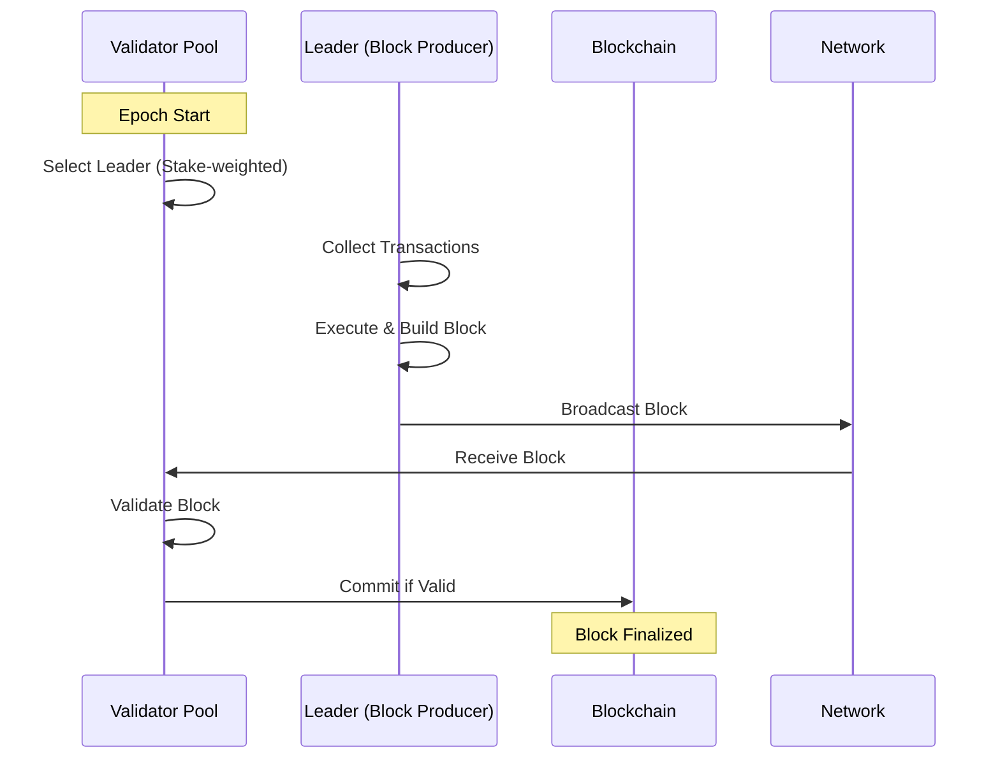
```mermaid
sequenceDiagram
    participant VP as Validator Pool
    participant L as Leader (Block Producer)
    participant BC as Blockchain
    participant N as Network

    Note over VP: Epoch Start
    VP->>VP: Select Leader (Stake-weighted)
    L->>L: Collect Transactions
    L->>L: Execute & Build Block
    L->>N: Broadcast Block
    N->>VP: Receive Block
    VP->>VP: Validate Block
    VP->>BC: Commit if Valid
    Note over BC: Block Finalized
```

### Commit-Reveal Weight Consensus

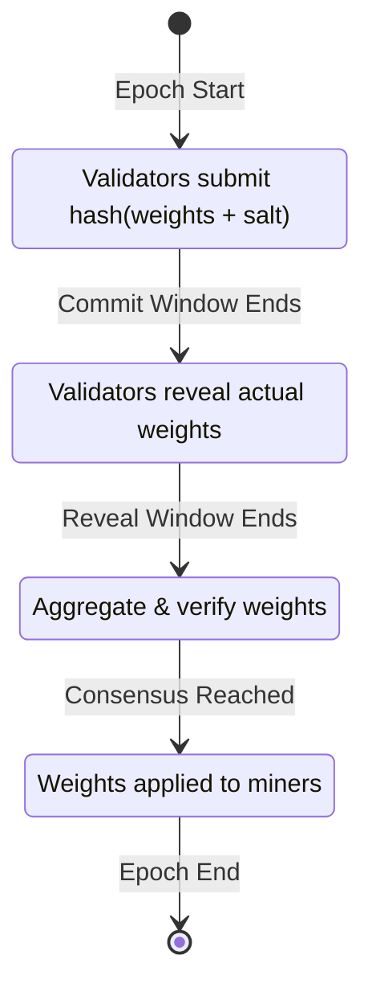
```mermaid
stateDiagram-v2
    [*] --> Committing: Epoch Start

    Committing: Validators submit hash(weights + salt)
    Committing --> Revealing: Commit Window Ends

    Revealing: Validators reveal actual weights
    Revealing --> Finalizing: Reveal Window Ends

    Finalizing: Aggregate & verify weights
    Finalizing --> Finalized: Consensus Reached

    Finalized: Weights applied to miners
    Finalized --> [*]: Epoch End
```

---

## 3. Transaction Lifecycle

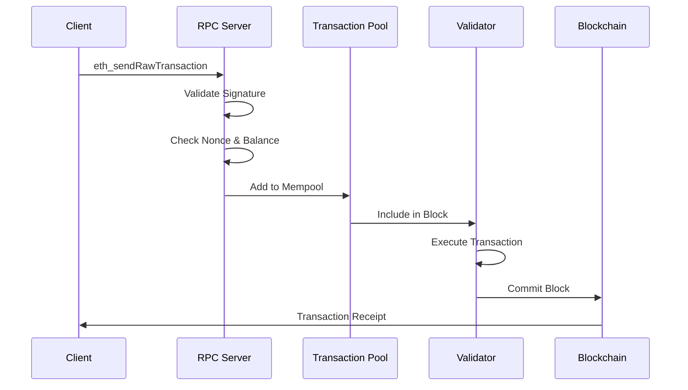
```mermaid
sequenceDiagram
    participant C as Client
    participant RPC as RPC Server
    participant TP as Transaction Pool
    participant V as Validator
    participant BC as Blockchain

    C->>RPC: eth_sendRawTransaction
    RPC->>RPC: Validate Signature
    RPC->>RPC: Check Nonce & Balance
    RPC->>TP: Add to Mempool
    TP->>V: Include in Block
    V->>V: Execute Transaction
    V->>BC: Commit Block
    BC->>C: Transaction Receipt
```

### Transaction Types

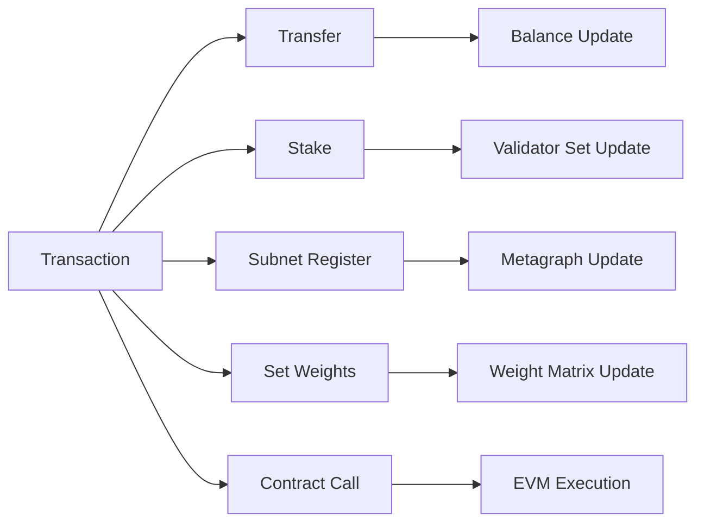
```mermaid
graph LR
    TX[Transaction] --> T1[Transfer]
    TX --> T2[Stake]
    TX --> T3[Subnet Register]
    TX --> T4[Set Weights]
    TX --> T5[Contract Call]

    T1 --> R1[Balance Update]
    T2 --> R2[Validator Set Update]
    T3 --> R3[Metagraph Update]
    T4 --> R4[Weight Matrix Update]
    T5 --> R5[EVM Execution]
```

---

## 4. Subnet/Neuron Model

### Subnet Hierarchy

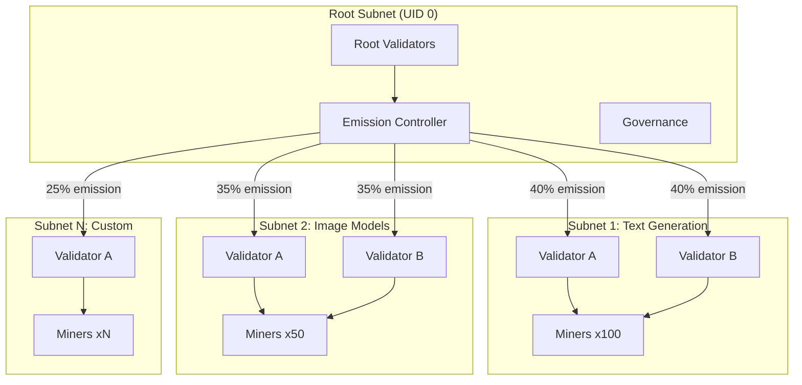
```mermaid
graph TB
    subgraph "Root Subnet (UID 0)"
        RS[Root Validators]
        EM[Emission Controller]
        GOV[Governance]
    end

    subgraph "Subnet 1: Text Generation"
        V1A[Validator A]
        V1B[Validator B]
        M1[Miners x100]
    end

    subgraph "Subnet 2: Image Models"
        V2A[Validator A]
        V2B[Validator B]
        M2[Miners x50]
    end

    subgraph "Subnet N: Custom"
        VNA[Validator A]
        MN[Miners xN]
    end

    RS --> EM
    EM -->|40% emission| V1A & V1B
    EM -->|35% emission| V2A & V2B
    EM -->|25% emission| VNA

    V1A & V1B --> M1
    V2A & V2B --> M2
    VNA --> MN
```

### Neuron Scoring Flow

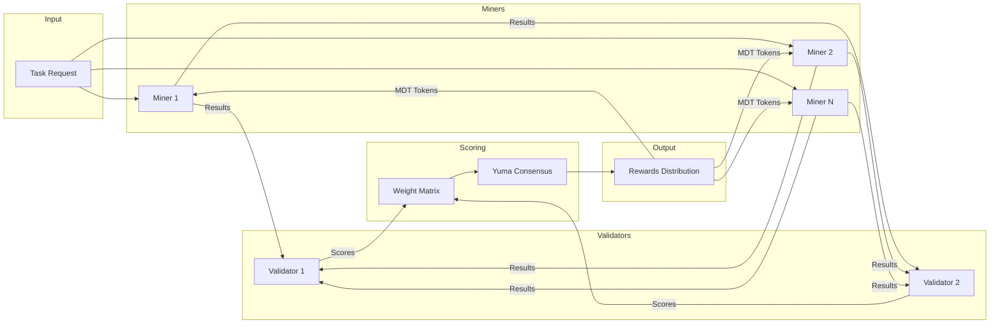
```mermaid
flowchart LR
    subgraph Input
        T[Task Request]
    end

    subgraph Miners
        M1[Miner 1]
        M2[Miner 2]
        Mn[Miner N]
    end

    subgraph Validators
        V1[Validator 1]
        V2[Validator 2]
    end

    subgraph Scoring
        W[Weight Matrix]
        Y[Yuma Consensus]
    end

    subgraph Output
        R[Rewards Distribution]
    end

    T --> M1 & M2 & Mn
    M1 & M2 & Mn -->|Results| V1 & V2
    V1 & V2 -->|Scores| W
    W --> Y --> R
    R -->|MDT Tokens| M1 & M2 & Mn
```

---

## 5. Tokenomics Flow

### Emission & Reward Distribution

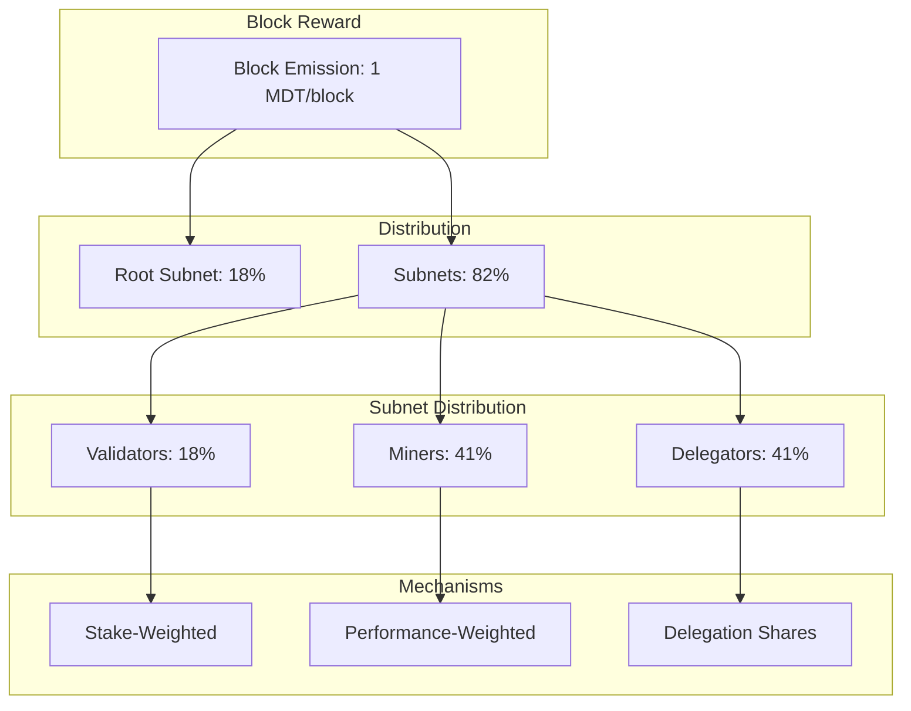
```mermaid
flowchart TB
    subgraph "Block Reward"
        BR[Block Emission: 1 MDT/block]
    end

    subgraph "Distribution"
        BR --> RS[Root Subnet: 18%]
        BR --> SN[Subnets: 82%]
    end

    subgraph "Subnet Distribution"
        SN --> VR[Validators: 18%]
        SN --> MR[Miners: 41%]
        SN --> DR[Delegators: 41%]
    end

    subgraph "Mechanisms"
        VR --> SW[Stake-Weighted]
        MR --> PW[Performance-Weighted]
        DR --> DS[Delegation Shares]
    end
```

### Token Flow Diagram

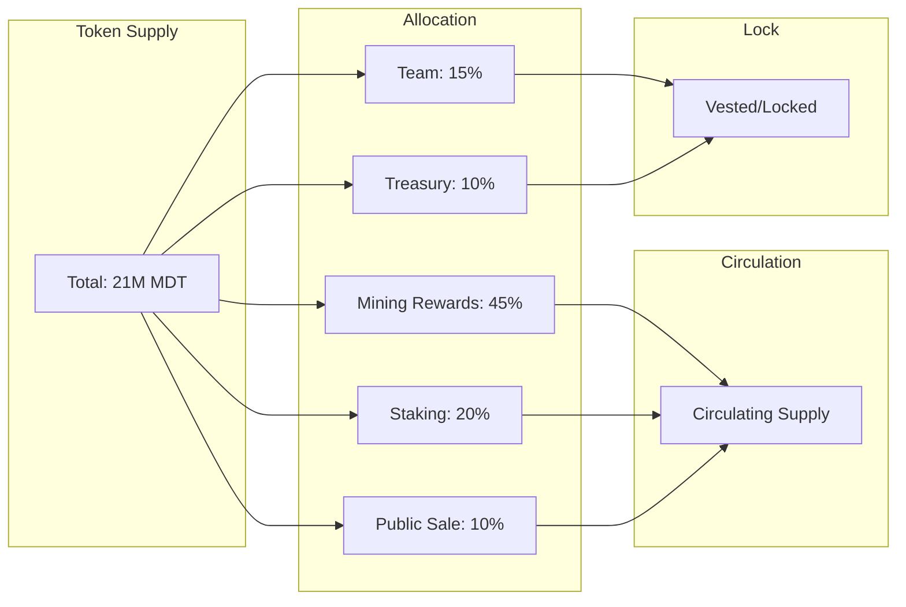
```mermaid
graph LR
    subgraph "Token Supply"
        TS[Total: 21M MDT]
    end

    subgraph "Allocation"
        TS --> A1[Mining Rewards: 45%]
        TS --> A2[Staking: 20%]
        TS --> A3[Team: 15%]
        TS --> A4[Treasury: 10%]
        TS --> A5[Public Sale: 10%]
    end

    subgraph "Circulation"
        A1 --> C[Circulating Supply]
        A2 --> C
        A5 --> C
    end

    subgraph "Lock"
        A3 --> L[Vested/Locked]
        A4 --> L
    end
```

---

## 6. Security & Anti-Cheat

### Multi-Layer Security

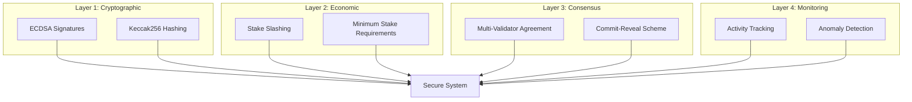
```mermaid
graph TB
    subgraph "Layer 1: Cryptographic"
        L1[ECDSA Signatures]
        L1B[Keccak256 Hashing]
    end

    subgraph "Layer 2: Economic"
        L2[Stake Slashing]
        L2B[Minimum Stake Requirements]
    end

    subgraph "Layer 3: Consensus"
        L3[Multi-Validator Agreement]
        L3B[Commit-Reveal Scheme]
    end

    subgraph "Layer 4: Monitoring"
        L4[Activity Tracking]
        L4B[Anomaly Detection]
    end

    L1 & L1B --> S[Secure System]
    L2 & L2B --> S
    L3 & L3B --> S
    L4 & L4B --> S
```

### Anti-Cheat Mechanism Flow

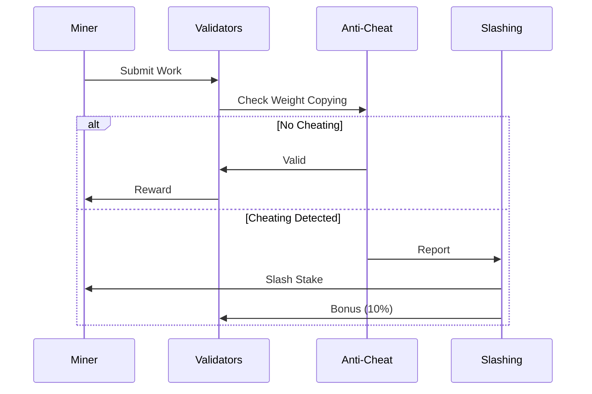
```mermaid
sequenceDiagram
    participant M as Miner
    participant V as Validators
    participant AC as Anti-Cheat
    participant SL as Slashing

    M->>V: Submit Work
    V->>AC: Check Weight Copying

    alt No Cheating
        AC->>V: Valid
        V->>M: Reward
    else Cheating Detected
        AC->>SL: Report
        SL->>M: Slash Stake
        SL->>V: Bonus (10%)
    end
```

---

## 7. Data Flow Architecture

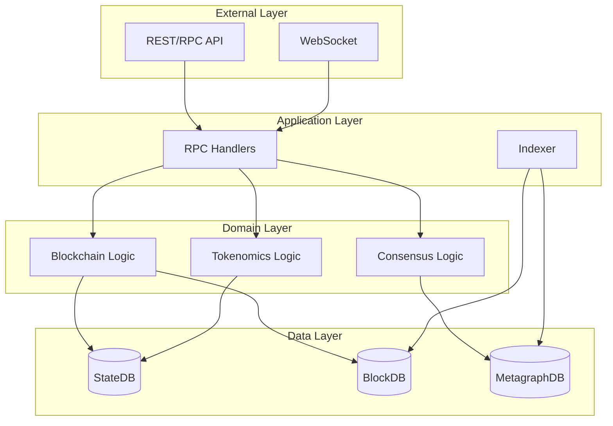
```mermaid
graph TB
    subgraph "External Layer"
        API[REST/RPC API]
        WS[WebSocket]
    end

    subgraph "Application Layer"
        RPC[RPC Handlers]
        IDX[Indexer]
    end

    subgraph "Domain Layer"
        BL[Blockchain Logic]
        CL[Consensus Logic]
        TL[Tokenomics Logic]
    end

    subgraph "Data Layer"
        SDB[(StateDB)]
        BDB[(BlockDB)]
        MDB[(MetagraphDB)]
    end

    API --> RPC
    WS --> RPC
    RPC --> BL & CL & TL
    BL --> SDB & BDB
    CL --> MDB
    TL --> SDB
    IDX --> BDB & MDB
```

---

## 8. Deployment Architecture

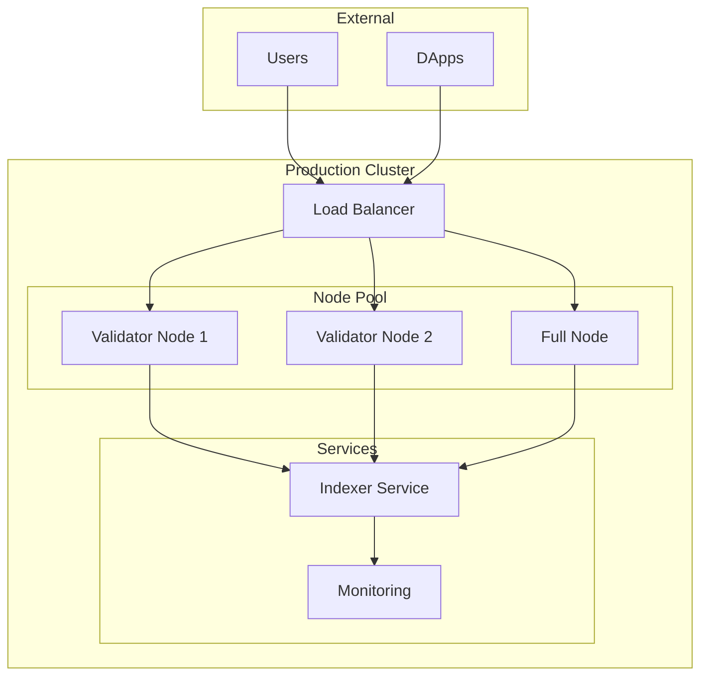
```mermaid
graph TB
    subgraph "Production Cluster"
        LB[Load Balancer]

        subgraph "Node Pool"
            N1[Validator Node 1]
            N2[Validator Node 2]
            N3[Full Node]
        end

        subgraph "Services"
            IDX[Indexer Service]
            MON[Monitoring]
        end
    end

    subgraph "External"
        U[Users]
        D[DApps]
    end

    U & D --> LB
    LB --> N1 & N2 & N3
    N1 & N2 & N3 --> IDX
    IDX --> MON
```

---

## 9. Native AI Integration (Phase 8-9)

### AI Primitives (Precompiles 0x22-0x28)

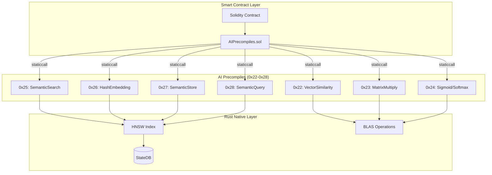
```mermaid
graph TB
    subgraph "Smart Contract Layer"
        SC[Solidity Contract]
        SDK[AIPrecompiles.sol]
    end

    subgraph "AI Precompiles (0x22-0x28)"
        P22[0x22: VectorSimilarity]
        P23[0x23: MatrixMultiply]
        P24[0x24: Sigmoid/Softmax]
        P25[0x25: SemanticSearch]
        P26[0x26: HashEmbedding]
        P27[0x27: SemanticStore]
        P28[0x28: SemanticQuery]
    end

    subgraph "Rust Native Layer"
        HNSW[HNSW Index]
        BLAS[BLAS Operations]
        SDB[(StateDB)]
    end

    SC --> SDK
    SDK -->|staticcall| P22 & P23 & P24 & P25 & P26 & P27 & P28
    P22 & P23 & P24 --> BLAS
    P25 & P26 --> HNSW
    P27 & P28 --> HNSW
    HNSW --> SDB
```

### HNSW Semantic Layer

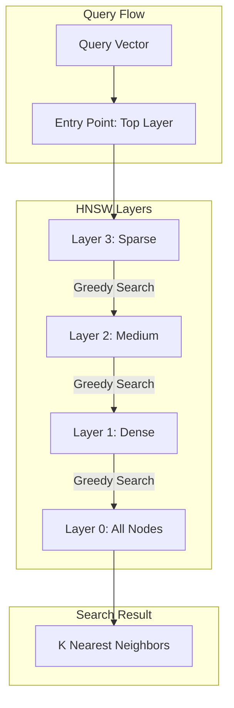
```mermaid
graph TB
    subgraph "Query Flow"
        Q[Query Vector]
        EP[Entry Point: Top Layer]
    end

    subgraph "HNSW Layers"
        L3[Layer 3: Sparse]
        L2[Layer 2: Medium]
        L1[Layer 1: Dense]
        L0[Layer 0: All Nodes]
    end

    subgraph "Search Result"
        KNN[K Nearest Neighbors]
    end

    Q --> EP --> L3
    L3 -->|Greedy Search| L2
    L2 -->|Greedy Search| L1
    L1 -->|Greedy Search| L0
    L0 --> KNN
```

### World Semantic Index

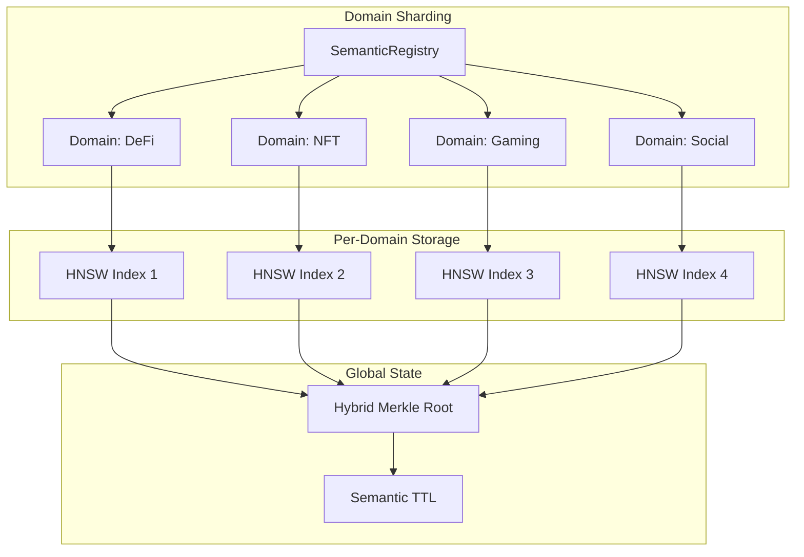
```mermaid
graph TB
    subgraph "Domain Sharding"
        REG[SemanticRegistry]
        D1[Domain: DeFi]
        D2[Domain: NFT]
        D3[Domain: Gaming]
        D4[Domain: Social]
    end

    subgraph "Per-Domain Storage"
        S1[HNSW Index 1]
        S2[HNSW Index 2]
        S3[HNSW Index 3]
        S4[HNSW Index 4]
    end

    subgraph "Global State"
        HR[Hybrid Merkle Root]
        TTL[Semantic TTL]
    end

    REG --> D1 & D2 & D3 & D4
    D1 --> S1
    D2 --> S2
    D3 --> S3
    D4 --> S4
    S1 & S2 & S3 & S4 --> HR
    HR --> TTL
```

---

## 10. Security Hardening (Phase 8b)

### Production Rate Limiting

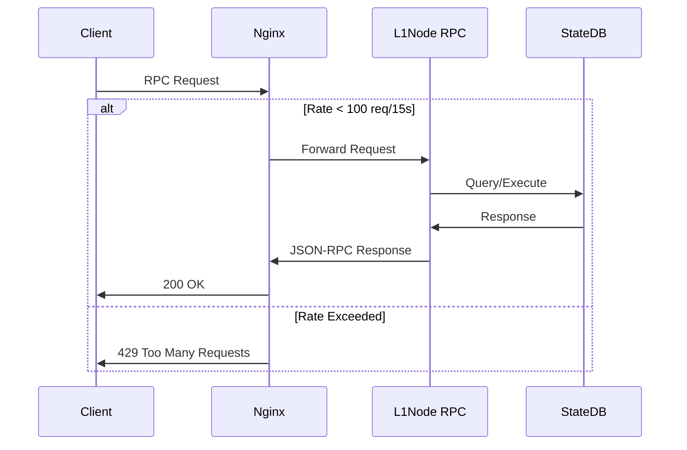
```mermaid
sequenceDiagram
    participant C as Client
    participant NG as Nginx
    participant RPC as L1Node RPC
    participant SDB as StateDB

    C->>NG: RPC Request

    alt Rate < 100 req/15s
        NG->>RPC: Forward Request
        RPC->>SDB: Query/Execute
        SDB->>RPC: Response
        RPC->>NG: JSON-RPC Response
        NG->>C: 200 OK
    else Rate Exceeded
        NG->>C: 429 Too Many Requests
    end
```

### Security Layers (Feb 2026)

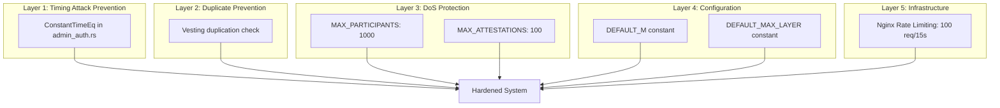
```mermaid
graph TB
    subgraph "Layer 1: Timing Attack Prevention"
        TA[ConstantTimeEq in admin_auth.rs]
    end

    subgraph "Layer 2: Duplicate Prevention"
        DP[Vesting duplication check]
    end

    subgraph "Layer 3: DoS Protection"
        DOS1[MAX_PARTICIPANTS: 1000]
        DOS2[MAX_ATTESTATIONS: 100]
    end

    subgraph "Layer 4: Configuration"
        CFG1[DEFAULT_M constant]
        CFG2[DEFAULT_MAX_LAYER constant]
    end

    subgraph "Layer 5: Infrastructure"
        INF[Nginx Rate Limiting: 100 req/15s]
    end

    TA & DP & DOS1 & DOS2 & CFG1 & CFG2 & INF --> SEC[Hardened System]
```

---

## 11. Complete System Overview (Feb 2026)

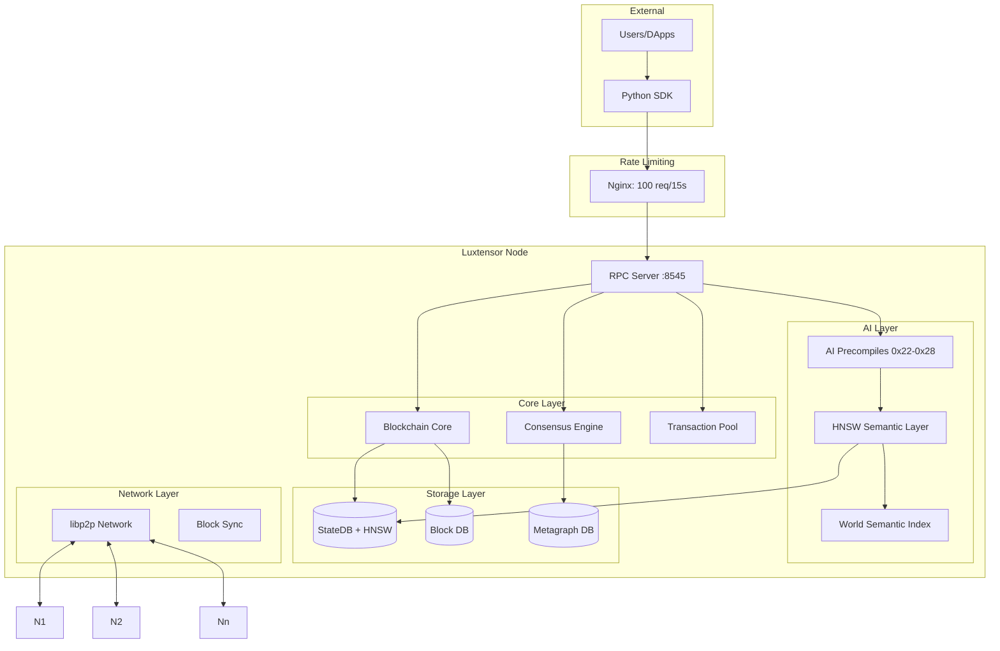
```mermaid
graph TB
    subgraph "External"
        U[Users/DApps]
        SDK[Python SDK]
    end

    subgraph "Rate Limiting"
        NG[Nginx: 100 req/15s]
    end

    subgraph "Luxtensor Node"
        RPC[RPC Server :8545]

        subgraph "Core Layer"
            BC[Blockchain Core]
            CS[Consensus Engine]
            TX[Transaction Pool]
        end

        subgraph "AI Layer"
            AIP[AI Precompiles 0x22-0x28]
            HNSW[HNSW Semantic Layer]
            WSI[World Semantic Index]
        end

        subgraph "Storage Layer"
            SDB[(StateDB + HNSW)]
            BDB[(Block DB)]
            MDB[(Metagraph DB)]
        end

        subgraph "Network Layer"
            P2P[libp2p Network]
            SYNC[Block Sync]
        end
    end

    U --> SDK --> NG --> RPC
    RPC --> BC & CS & TX & AIP
    AIP --> HNSW --> WSI
    BC --> SDB & BDB
    HNSW --> SDB
    CS --> MDB
    P2P <--> N1 & N2 & Nn
```

---

**Current Status: ~95% Complete - Security Hardening Complete!**

*Last updated: February 2026*
