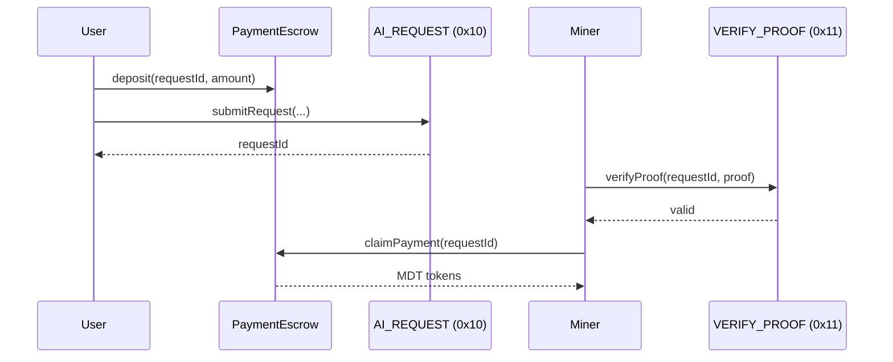

# LuxTensor AI Precompiles Specification

LuxTensor implements native AI opcodes as EVM precompiled contracts, enabling on-chain AI inference coordination with minimal gas costs.

## Precompile Addresses

| Address | Name | Purpose |
|---------|------|---------|
| `0x10` | AI_REQUEST | Submit AI inference requests |
| `0x11` | VERIFY_PROOF | Verify zkML proofs |
| `0x12` | GET_RESULT | Retrieve inference results |
| `0x13` | COMPUTE_PAYMENT | Calculate payment for request |

## Gas Costs

```rust
pub mod gas_costs {
    pub const AI_REQUEST_BASE: u64 = 21_000;
    pub const AI_REQUEST_PER_BYTE: u64 = 16;
    pub const VERIFY_PROOF_BASE: u64 = 50_000;
    pub const VERIFY_PROOF_PER_BYTE: u64 = 8;
    pub const GET_RESULT: u64 = 3_000;
    pub const COMPUTE_PAYMENT: u64 = 1_000;
}
```

---

## AI_REQUEST (0x10)

Submit an AI inference request to the network.

### Input Format (128 bytes)

| Offset | Size | Field | Description |
|--------|------|-------|-------------|
| 0 | 32 | model_hash | Hash of AI model to use |
| 32 | 32 | input_hash | Hash of input data |
| 64 | 20 | callback | Callback contract address |
| 84 | 12 | _padding | Reserved |
| 96 | 32 | reward | MDT reward amount (uint256) |

### Output

32 bytes: `request_id` - Unique identifier for tracking

### Solidity Example

```solidity
// Call AI_REQUEST precompile
(bool success, bytes memory result) = address(0x10).staticcall(
    abi.encodePacked(modelHash, inputHash, callback, reward)
);
bytes32 requestId = abi.decode(result, (bytes32));
```

---

## VERIFY_PROOF (0x11)

Verify a zkML proof for an AI inference result.

### Input Format

| Offset | Size | Field | Description |
|--------|------|-------|-------------|
| 0 | 32 | request_id | Request to verify |
| 32 | variable | proof_data | zkML proof bytes |

### Output

32 bytes: `0x01` (valid) or `0x00` (invalid)

---

## GET_RESULT (0x12)

Retrieve the result of a completed AI request.

### Input

32 bytes: `request_id`

### Output

| Field | Type | Description |
|-------|------|-------------|
| status | uint8 | 0=pending, 1=fulfilled, 2=failed |
| result_hash | bytes32 | Hash of result data |
| fulfiller | address | Miner who fulfilled |

---

## COMPUTE_PAYMENT (0x13)

Calculate the required payment for an AI request.

### Input

| Offset | Size | Field | Description |
|--------|------|-------|-------------|
| 0 | 32 | model_hash | Model to use |
| 32 | 4 | input_size | Size of input data in bytes |

### Output

32 bytes: `payment` (uint256) - Required MDT tokens

### Pricing Formula

```
payment = BASE_COST + (input_size * PER_BYTE_COST)

BASE_COST = 0.01 MDT (10^16 wei)
PER_BYTE_COST = 0.00001 MDT (10^13 wei)
```

---

## Integration with PaymentEscrow

The precompiles work with the `PaymentEscrow.sol` contract:



## Source Code

- Rust: `crates/luxtensor-contracts/src/ai_precompiles.rs`
- Solidity: `contracts/src/templates/PaymentEscrow.sol`
- Integration: `crates/luxtensor-contracts/src/revm_integration.rs`

---

*Last updated: 2026-02-02*
